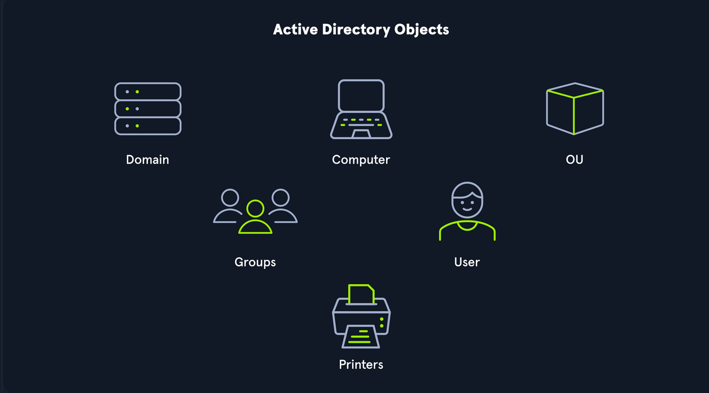

#  Active Directory Objects

Active Directory (AD) objects represent any resource in the directory. Examples include OUs, users, groups, printers, shared folders, and domain controllers.

---

##  Users
- **Leaf object** – cannot contain other objects.
- Have a **SID** (Security Identifier) and **GUID** (Global Unique ID).
- Attributes include: last login time, password change date, email, description, etc.
- Critical target for attackers – access can allow enumeration of entire domain or forest.

---

##  Contacts
- Represents an external user (e.g., vendor or client).
- Not a **security principal** – has only a GUID, not a SID.
- Attributes include name, email, phone, etc.
- **Leaf object.**

---

##  Printers
- **Leaf object** – represents networked printers.
- Not a security principal – only GUID.
- Attributes: printer name, driver, port, etc.

---

##  Computers
- **Leaf object** – any domain-joined computer.
- Has both **SID** and **GUID**.
- Targeted by attackers for privilege escalation or enumeration.

---

##  Shared Folders
- Represent shared folders on systems.
- Can be:
  - **Open to Everyone** – no credentials required.
  - **Restricted to Authenticated Users or Specific Groups**.
- Not a security principal – only has a GUID.

---

##  Groups
- **Container object** – contains users, computers, or other groups.
- **Security principal** – has SID and GUID.
- Used to manage permissions (e.g., nested groups can escalate privileges).

---

##  Organizational Units (OUs)
- Used for grouping similar objects for easier management.
- Support **delegation of control** (e.g., password resets, GPOs).
- Essential for organizing departments, teams, or functional groups.

---

##  Domain
- Core AD structure containing users, computers, OUs, and groups.
- Each domain has its own database and policies (e.g., password policy).
- Example: blocking `cmd.exe` for non-admins via Group Policy.

---

##  Domain Controllers
- **Brains of the domain** – handle authentication and authorization.
- Validate user credentials and enforce security policies.

---

##  Sites
- Define network topology across subnets.
- Ensure **efficient replication** between domain controllers.

---

##  Built-in Container
- Contains default domain groups (e.g., Administrators, Users).
- Created automatically during domain setup.

---

##  Foreign Security Principals (FSPs)
- Represent external users or groups from trusted forests.
- Automatically created when added to a group.
- Stored in: `CN=ForeignSecurityPrincipals,DC=mylab,DC=com`.

---
