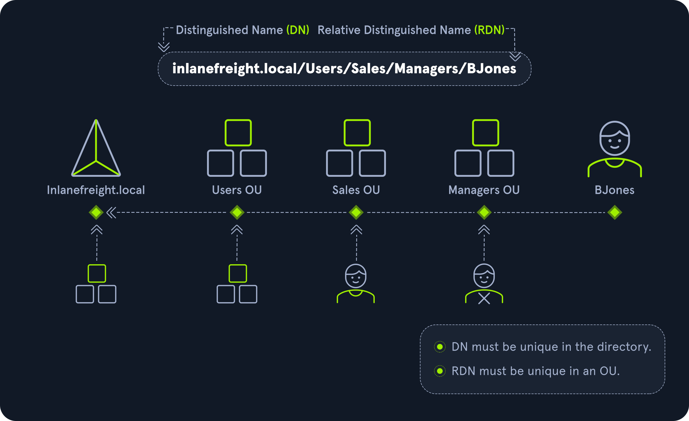

### Object
- Defined as any resource present within an Active Directory.
- Examples: printers, users, groups, Organizational Units (OUs), domain controllers.

### Attribute
- Defines characteristics of a given object.
- Example: A computer object contains attributes such as hostname and DNS name.
- Attributes in Active Directory follow LDAP syntax.

### Schema
- The blueprint of any enterprise environment.
- Defines the types of objects that can exist in the AD database.
- Example: A user belongs to the class `user`, and a computer object belongs to `computer`.
- Each object has its own information stored in attributes.

### Domain
- A logical group of objects such as computers, users, groups, and OUs.
- Different domains can connect through **Trust Relationships**.

### Forest
- A collection of domains, where each domain can have subdomains.

Example:
```bash
# Forest
vuln.local
  ├── us.vuln.local
  └── eg.vuln.local
```

### Tree
- A collection of domains that starts from a single root domain.
- All domains in a tree share a **Global Catalog** containing information about all objects in the tree.

Example:
```bash
# Tree
sales.local
  ├── us.sales.local
  └── eg.sales.local
```

### Container
- Objects that can contain other objects.
- Example: A `user` container object that contains employee objects.

### Leaf
- Objects that do not contain other objects.
- Found at the end of the subtree hierarchy.
- Example: A `users` object with no sub-objects.

### Global Unique Identifier (GUID)
- A unique 128-bit value assigned when a domain user or group is created.
- Similar in concept to a MAC address.
- Stored in the `ObjectGUID` attribute.
- Can be used to query objects (users, groups, computers, domain controllers) using Distinguished Name, GUID, SID, or SAM account name.

### Security Principals
- AD domain objects that can manage access to other resources within the domain.
- Each security principal is assigned a unique identifier.
- Local user accounts are managed by **Security Accounts Manager (SAM)**.

### Security Identifier (SID)
- A unique identifier for a security principal or security group.
- Every account, group, and process has its own SID.
- In AD, SIDs are issued by the domain controller and stored securely.
- Once deleted, a SID cannot be reused in the same environment.

#### Well-Known SIDs
- Used to identify common users and groups.
- More info: [Well-known SIDs](https://ldapwiki.com/wiki/Wiki.jsp?page=Well-known%20Security%20Identifiers)

### Distinguished Name (DN)
- Describes the full path of an object in AD.

Example:
```
cn=it-user,ou=IT,ou=Employee,dc=htb,dc=local
```

- This indicates that `it-user` works in the IT department at the company `htb`, and the account is created in an OU for employees.

### Relative Distinguished Name (RDN)
- A single component of the DN that uniquely identifies an object within its parent container.
- AD does not allow two objects with the same name under the same parent container.
- However, identical RDNs can exist in different containers.

Example:
```
cn=it-user,ou=IT,ou=Employee,dc=htb,dc=local
```

